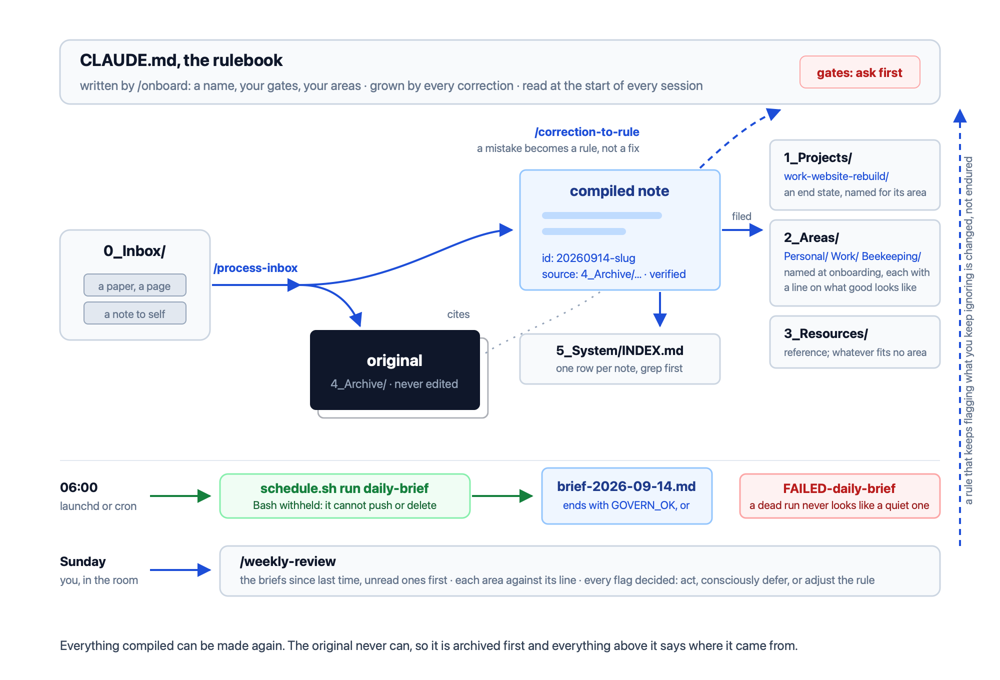

# GOVERN: A second brain that shows its work

Six principles for trusting an AI-run knowledge base, and the script and prompts that put them in place.

> Every second-brain system solves capture. Almost none solve trust.

| | | |
|---|---|---|
| **G** | Gates | Name the actions that can never happen without you (keep the list short) |
| **O** | Origins | Originals are archived untouched, and everything compiled from them cites the file it came from |
| **V** | Verification | Every claim says how well it was checked: verified, unverified, blocked or inferred |
| **E** | Evidence | If it can be counted, count it. An estimate is not evidence |
| **R** | Rules | Every correction becomes a rule, written so a stranger would get it right |
| **N** | Nothing assumed | No ritual assumes the previous one happened |

The reasoning behind each principle is at [pardel.dev/govern](https://www.pardel.dev/govern/), which is the framework's home and gets updated as the system changes. The story of how it got there is in [The Governed Second Brain](https://www.pardel.dev/2026/07/25/the-governed-second-brain.html).

## Contents

1. [Project structure](#project-structure)
2. [Requirements](#requirements)
3. [Quick start](#quick-start)
4. [Commands](#commands)
   - [`/onboard`](#onboard) - Interview you for a name, the gates, your areas and the schedule, then write the rulebook.
   - [`/process-inbox`](#process-inbox) - Archive each original untouched, compile a note that cites it.
   - [`/correction-to-rule`](#correction-to-rule) - Turn a correction into a rule instead of a fix.
   - [`/daily-brief`](#daily-brief) - A brief written before you wake, with every source stated.
   - [`/refute`](#refute) - Try to break a note against its original rather than confirm it.
   - [`/lint`](#lint) - Find what is dangling, unsourced, stale or orphaned.
   - [`/recruit`](#recruit) - Interview, then file a worker profile and a roster row.
   - [`/memory-consolidation`](#memory-consolidation) - Find which remembered facts stopped being true.
   - [`/daily-brief-grown`](#daily-brief-grown) - The brief after three months of use. For later.
   - [`/weekly-review`](#weekly-review) - Every flag decided rather than noticed. For later.
   - [`/retrieval-metrics`](#retrieval-metrics) - Whether the base can still find things. For later.
5. [Changing the commands](#changing-the-commands)
6. [Portability and security](#portability-and-security)
7. [Running it unattended](#running-it-unattended)
8. [Seeing what you have](#seeing-what-you-have)
9. [Evals](#evals)
10. [Why there is no CLAUDE.md in this repo](#why-there-is-no-claudemd-in-this-repo)
11. [Licence](#licence)

## Project structure



| | |
|---|---|
| [`setup.sh`](https://github.com/pardel/govern/blob/main/setup.sh) | the deterministic half: folders, git, one commit, eleven commands, three tools, one hook |
| [`prompts/`](https://github.com/pardel/govern/tree/main/prompts) | eight plain-text prompts, one per command |
| [`prompts/later/`](https://github.com/pardel/govern/tree/main/prompts/later) | what three of these grow into after months of use |
| [`tools/status.sh`](https://github.com/pardel/govern/blob/main/tools/status.sh) | reads the base, writes one HTML page of what you have |
| [`tools/greet.sh`](https://github.com/pardel/govern/blob/main/tools/greet.sh) | greets each new session with what is waiting, overdue or failing |
| [`tools/schedule.sh`](https://github.com/pardel/govern/blob/main/tools/schedule.sh) | runs one command unattended, once, and says plainly when it did not; writes or prints the scheduler entry for this machine |
| [`evals/`](https://github.com/pardel/govern/tree/main/evals) | the checks that keep this repo honest about itself |
| [`CHANGELOG.md`](https://github.com/pardel/govern/blob/main/CHANGELOG.md) | what was decided and what failed, newest first, and what an earlier base would notice |

The folders it creates are [PARA](https://fortelabs.com/blog/para/), Tiago Forte's scheme for filing by how actionable a thing is rather than by what subject it belongs to, with an inbox in front and one folder added at the back for the system's own workings:

```
0_Inbox      things that arrived and haven't been dealt with
1_Projects   efforts with an end state
2_Areas      ongoing responsibilities that have none
3_Resources  reference material with no deadline
4_Archive    everything retired, and every original, untouched
5_System     the machinery, kept out of your content
```

Two conventions below that, both written into the rulebook by `/onboard`. A project folder is prefixed with the area its work is credited to, `1_Projects/work-website-rebuild`, so the brief and the review can say which area a project serves without a lookup. And code lives inside the project or area it belongs to, at `_repos/<repo-name>/`, each repository its own, registered as a submodule pointing at its real remote. Notes and code are never committed as one act, and the runner's unattended commit leaves submodule pointers where they are: a pointer moves only when a person bumps it, because a pointer pinned to a commit no clone can fetch is the failure the convention exists to prevent.

<p align="right"><sub><a href="#contents">Go to top</a></sub></p>

## Requirements

Three things, and you probably have two of them already:

```bash
bash --version    # 3.2 or newer; macOS ships 3.2
git --version     # any version
claude --version  # Claude Code
```

If `git` is missing, [git-scm.com/install](https://git-scm.com/install/) covers macOS, Linux and Windows. `curl` is needed too, by the setup and later by the page watcher, and it comes with macOS and most Linux systems.

[Claude Code](https://www.claude.com/product/claude-code) is what this was built and tested against, and what the prompts are written for, so it is the one to reach for first. Any assistant that loads a rulebook at the start of a session and can write files will run them too. The prompts name `CLAUDE.md`, so substitute whichever file yours reads.

There is no database, no server, no application and no format that belongs to anyone. Everything is folders and text files.

The three `for later` commands need four more, for JSON state, structured search, GitHub issues and PDF text extraction:

```bash
brew install jq ripgrep gh poppler            # macOS
sudo apt install jq ripgrep gh poppler-utils  # Debian, Ubuntu
```

A scheduler, either `cron` or `launchd`, comes with your system. [Running it unattended](#running-it-unattended) is what to do with it, and what this kit does not do to it for you.

<p align="right"><sub><a href="#contents">Go to top</a></sub></p>

## Quick start

Read the script before you run it: [setup.sh](https://github.com/pardel/govern/blob/main/setup.sh) is two hundred and six lines and reaches for nothing beyond `mkdir`, `touch`, `printf`, `curl` and `git`. Cloned rather than curled, it uses the prompts and tools beside it and fetches nothing. Where the knowledge base lives matters more than it looks, so it is worth a minute on [Portability and security](#portability-and-security) before you pick a folder. If you would rather see the choices laid out, [pardel.dev/govern/onboard](https://www.pardel.dev/govern/onboard/) walks the same steps in a browser and writes nothing itself.

```bash
cd /Volumes/kb && curl -fsSL https://raw.githubusercontent.com/pardel/govern/main/setup.sh | bash
```

Any empty folder will do in place of `/Volumes/kb`. The two steps are chained with `&&` so that if the `cd` fails, the script never runs, and it refuses a folder that is not empty in any case, so a stray run cannot lay a base out in your home folder. Keep a comment off that line: zsh, the macOS default, does not treat `#` as one when you paste it.

**Then the half no script can write for you.** Start Claude Code in that folder and run:

```
/onboard
```

It asks the five things only you can answer: what to call the assistant, which actions must never happen without your yes, what you are responsible for and what good looks like there, and whether to write the brief before you wake. Nothing else in this kit is worth running before that.

**Updating a base you already have.** The same script with `--update`, from the base's folder, refreshes the commands and the tools and touches nothing else: no folders, no git init, never the rulebook. It insists on a clean tree, commits nothing, and leaves a diff for you to read, so a command you had reshaped is one `git checkout -- <file>` from being yours again. [`CHANGELOG.md`](https://github.com/pardel/govern/blob/main/CHANGELOG.md) says what changed and why.

```bash
cd ~/kb && curl -fsSL https://raw.githubusercontent.com/pardel/govern/main/setup.sh | bash -s -- --update
```

<p align="right"><sub><a href="#contents">Go to top</a></sub></p>

## Commands

**Start with three.** `/onboard` once, then `/process-inbox` and `/correction-to-rule` as often as they come up. That is the whole first month. The rest install because a command you never run costs nothing, and having them there beats discovering later that they existed. Reach for them when you feel the need rather than because they are in the list: a lint pass over eleven notes tells you nothing, and a team of one is a folder.

### /onboard

Run it once, first: it asks the five things only you can answer, a name, the gates, your areas, a line on each and the brief's hour, then writes the rulebook, and refuses to overwrite one that already exists.

Prompt: [`prompts/onboard.txt`](https://github.com/pardel/govern/blob/main/prompts/onboard.txt) · More: [pardel.dev/govern](https://www.pardel.dev/govern/#onboard).

### /process-inbox

For each item in `0_Inbox/`, archives the original untouched, writes a compiled note with a stable id that cites it, adds the index row, and checks its own work before saying done.

Prompt: [`prompts/process-inbox.txt`](https://github.com/pardel/govern/blob/main/prompts/process-inbox.txt) · More: [pardel.dev/govern](https://www.pardel.dev/govern/#process-inbox).

### /correction-to-rule

Turns a correction into a rule written for a stranger, proves any claim about a tool before saving it, and fixes the wrong fact everywhere it was copied.

Prompt: [`prompts/correction-to-rule.txt`](https://github.com/pardel/govern/blob/main/prompts/correction-to-rule.txt) · More: [pardel.dev/govern](https://www.pardel.dev/govern/#correction-to-rule).

### /daily-brief

Writes the day's brief, what matters, what is due and every source with its status, and is what the scheduled job runs before you wake.

Prompt: [`prompts/daily-brief.txt`](https://github.com/pardel/govern/blob/main/prompts/daily-brief.txt) · More: [pardel.dev/govern](https://www.pardel.dev/govern/#daily-brief).

### /refute

Tries to break a note against its archived original rather than confirm it, and reports what broke and what held.

Prompt: [`prompts/refute.txt`](https://github.com/pardel/govern/blob/main/prompts/refute.txt) · More: [pardel.dev/govern](https://www.pardel.dev/govern/#refute).

### /lint

Counts what is dangling, unsourced, stale, orphaned or unparseable, fixes only the mechanical, and reports the rest.

Prompt: [`prompts/lint.txt`](https://github.com/pardel/govern/blob/main/prompts/lint.txt) · More: [pardel.dev/govern](https://www.pardel.dev/govern/#lint).

### /recruit

Adds a named worker with a remit and an "is not permitted" list, drawing the name from the family the rulebook set.

Prompt: [`prompts/recruit.txt`](https://github.com/pardel/govern/blob/main/prompts/recruit.txt) · More: [pardel.dev/govern](https://www.pardel.dev/govern/#recruit).

### /memory-consolidation

Sweeps what the assistant remembers between sessions for facts that stopped being true, and proposes rather than deletes.

Prompt: [`prompts/memory-consolidation.txt`](https://github.com/pardel/govern/blob/main/prompts/memory-consolidation.txt) · More: [pardel.dev/govern](https://www.pardel.dev/govern/#memory-consolidation).

### /daily-brief-grown

**For later.** The brief after months of use, with the counting pushed out to a script and escalation written in.

Prompt: [`prompts/later/daily-brief.txt`](https://github.com/pardel/govern/blob/main/prompts/later/daily-brief.txt) · More: [pardel.dev/govern](https://www.pardel.dev/govern/#daily-brief-grown).

### /weekly-review

**For later.** Every flag decided, act, defer or adjust the threshold, never merely noticed.

Prompt: [`prompts/later/weekly-review.txt`](https://github.com/pardel/govern/blob/main/prompts/later/weekly-review.txt) · More: [pardel.dev/govern](https://www.pardel.dev/govern/#weekly-review).

### /retrieval-metrics

**For later.** A fixed set of queries, every miss resolved by hand, the miss rate and its direction recorded.

Prompt: [`prompts/later/retrieval-metrics.txt`](https://github.com/pardel/govern/blob/main/prompts/later/retrieval-metrics.txt) · More: [pardel.dev/govern](https://www.pardel.dev/govern/#retrieval-metrics).

<p align="right"><sub><a href="#contents">Go to top</a></sub></p>

## Changing the commands

Each command is a file at `.claude/skills/<name>/SKILL.md`, and that is where to change it. They are starting points rather than a library to depend on, and a prompt you have reshaped to fit your own work is worth more than one you kept pristine.

`5_System/prompts/` is yours, and setup leaves it empty on purpose. Put the prompts you write there.

<p align="right"><sub><a href="#contents">Go to top</a></sub></p>

## Portability and security

Put the knowledge base on a volume you can carry. An encrypted disk image that mounts at a fixed path makes the whole thing one file to copy, to back up, or to move to another machine, and the fixed path is what lets the rulebook, the scripts and any scheduled jobs go on using absolute paths without being rewired every time the base moves house.

The disk-image recipes for macOS, Linux and Windows, and how private each one is, are on [pardel.dev/govern](https://www.pardel.dev/govern/#the-volume-on-each-platform).

**Git is what makes the writing safe.** The setup puts the knowledge base under version control from its first commit, and that is what makes it reasonable to let a model write into your notes without being asked every time, because every change becomes something you can see, diff and undo. That protection only covers what has been committed, so commit at natural boundaries rather than once a week. It is also why pushing to a remote belongs on your gates list while writing files does not: local history is recoverable, and anything that has left your machine is not.

**Version control is not a backup.** Git protects you from yourself, and will undo an overwrite, a bad recompile or a deletion you regret. It can do nothing about a failed disk, because the history is on that same disk. Either keep a copy of the history somewhere else, or decide deliberately that the archive is exactly as durable as one volume.

**A volume you can carry is a volume that ends up in two places.** The moment the base is on a second machine there are two copies, and every sync is a merge. Three rules kept the system this kit came from out of trouble, and it took four failures in a fortnight to learn them. One copy is authoritative and the other pulls from it, and a clone that commits without pushing holds work that exists nowhere else. Files both machines append to, the changelog above all, merge by union (`merge=union` in `.gitattributes`), so two entries written on the same day stack instead of conflicting. And files that describe the current state, the handoff note in particular, have one writer at a time and are replaced rather than appended to, because a snapshot merged from two machines describes neither of them.

<p align="right"><sub><a href="#contents">Go to top</a></sub></p>

## Running it unattended

`/daily-brief` says the brief is written before you wake, which only happens if something runs it while you are asleep. Setup copies in the runner for that and never calls it. `5_System/tools/schedule.sh` executes one command, once, whenever something asks it to.

**Later, not on day one.** An unattended session in a knowledge base whose gates list has not been written yet is this framework inside out, so the runner refuses to start until a `CLAUDE.md` exists and says why. Give it a rulebook, a few weeks of running the commands by hand, and enough in the base to brief you on. Then schedule the one command whose whole point is that it happens without you.

Run it by hand first, and read what it wrote:

```bash
bash 5_System/tools/schedule.sh run daily-brief
bash 5_System/tools/schedule.sh                  # how the last runs went
bash 5_System/tools/schedule.sh print daily-brief 6     # the entry to paste, paths filled in
bash 5_System/tools/schedule.sh install daily-brief 6   # macOS: write it as a launchd file and load it
```

The session gets `Read`, `Glob`, `Grep`, `Write` and `Edit`, and `Bash` is denied by name, which is your gates list enforced at the tool layer rather than asked for politely. A run has to print `GOVERN_OK` to count as finished, so a run that died and a run with nothing to say never look alike, and a failure leaves `5_System/logs/FAILED-<command>` on disk until the next good run. The scheduler owns the calendar and the runner runs once when asked. `/onboard` installs the entry on macOS through `schedule.sh install`, and `schedule.sh print` gives the launchd or cron form to paste anywhere else. What the runner refuses and why, the plist and the cron line by hand, and the four things that bite a scheduled job are on [pardel.dev/govern](https://www.pardel.dev/govern/#running-it-unattended).

<p align="right"><sub><a href="#contents">Go to top</a></sub></p>

## Seeing what you have

Setup installs one more thing: a script that reads the knowledge base and writes a single HTML page describing it.

```bash
bash 5_System/tools/status.sh > kb-status.html && open kb-status.html
```

Your gates list read back out of your own `CLAUDE.md`, which commands are installed, how many notes and originals exist, what is sitting in the inbox, and how long since anything happened. It doubles as a place to see how far through setup you are.

It is a script that writes a file, not an application. Nothing runs in the background, nothing watches anything, and the page does not update itself: re-run it when you want a fresh one. Every number on it was counted off the disk rather than estimated, which is the Evidence principle applied to the thing doing the displaying.

**Every session opens with the same facts.** Setup installs `tools/greet.sh` as a Claude Code `SessionStart` hook, so a new session is told, before it does anything, how many items wait in the inbox, when the last brief and the last lint were, whether a rulebook exists yet, and which scheduled run is still failing. Counted off the disk each time, never remembered from last time. It writes `.claude/settings.json` only if you have none, so a settings file of yours is never touched. Until a rulebook exists it also puts one line in front of you and tells the assistant that, whatever your first message says, its only reply is to ask whether to run the onboarding now, and to run it on a yes. A hook cannot send a message for you, so that is as close as it comes to starting the interview itself.

<p align="right"><sub><a href="#contents">Go to top</a></sub></p>

## Evals

A framework about trusting what a system tells you should be able to show its own work.

```bash
bash evals/run.sh              # deterministic, free, seconds
bash evals/run.sh --prompts    # adds the prompt evals, which need a model
```

The free tiers check that the repo describes itself accurately, and that `setup.sh` does what this README claims: a hundred and thirty-three assertions across a run where the prompts are reachable and one where they are not, including the unattended runner's failure path, driven by a stub rather than a model. The second matters more, because a setup script that half-fails and says so is fine, while one that half-fails and reports success is the failure the whole framework exists to prevent. It shipped that way for about ten minutes and only running it caught that.

The prompt evals plant known strings in a fixture and grep for them, rather than asking a model whether a model did well. `refute-catches-invention` gives a note three claims its source states verbatim and one it never made: a pass names the invented claim and leaves the other three alone, so the case can fail in both directions. A checker that flags everything has perfect recall and no worth.

More in [evals/README.md](https://github.com/pardel/govern/blob/main/evals/README.md), including the rule against editing a fixture to make a case pass.

<p align="right"><sub><a href="#contents">Go to top</a></sub></p>

## Why there is no CLAUDE.md in this repo

A ready-made rulebook would be the one thing this framework argues against. The gates list is a statement about what you are unwilling to have happen without being asked, and nobody else can write that for you. Ship it written and the first thing a new user does is accept a stranger's judgement about their own irreversible actions, which is the failure the Gates principle exists to prevent.

So the repo ships the half that is the same for everyone, being folders and version control, and a prompt that interviews you for the half that isn't. The interview offers eight gates to pick from, because a blank question is harder to answer well than a list to choose from, but nothing is selected for you and nothing is written until you have chosen. The one line it does not offer is the archive rule, which is not a gate but the premise: originals are never edited, and that is not the user's to switch off.

<p align="right"><sub><a href="#contents">Go to top</a></sub></p>

## Licence

MIT. See [LICENSE](https://github.com/pardel/govern/blob/main/LICENSE).

<p align="right"><sub><a href="#contents">Go to top</a></sub></p>
